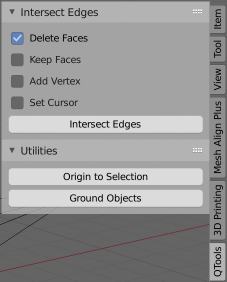

# **QTools - Blender Plugin**

## **Functions**

### **Intersect Edges**
Two selected edges are subdivided at their intersection and linked by a common vertex there  
(Edit-Mode)

#### Options
- Delete Faces  
  adjacent faces of the edges are deleted for manually restoration  
  this prevents non-planar faces
- Keep Faces  
  adjacent faces of the edges are kept, they get additional vertices  
  resulting faces might be non-planar (see warning)
- Set Cursor  
  sets the cursor to the intersection point

Delete and Keep Faces options mutually exclude each other

#### The following infos may be issued
- Works in edit mode only
- Select exactly two edges
- Edges are not independent  
  edges share or have vertices on the same position  
- Edges do not intersect  
  edges are running parallel  

no changes are made

#### The following warning may be issued
- Intersection not on edges  
  an intersection is found and used **but**  
  \- the intersection is not located on at least one edge  
  \- edges are seen as infinite lines, so the intersection may lay outside edge boundaries  
  \- if no 'physical' intersection is found the mid point of the shortest line between the edges is taken  
  \- 'Keep Faces' option might have produced non-planar faces  
  \- the results of the operation might not be useful

### **Ground Objects**
Drops selected objects to ground Z  
(Object- and Edit-Mode)

The following info may be issued
- No object(s) selected

Grounding objects in edit-mode may not work in some cases 

### **Origin to Selection**
An objects origin is set to the mid point of the selected vertices, edges or faces  
(Edit-Mode)

The following info may be issued  
- Works in edit mode only
- Nothing selected

The cursor is set to this point also

## **Remarks**
\- Press N-key or check View/Sidebar in Blender to show QTools in sidebar  
\- Developed for Blender 2.80 with VSCode + Blender Plugin + Python 3

## **Versions**
\- 0.0.1 initial

---

#### contact
[qrt@qland.de](mailto:qrt@qland.de)
